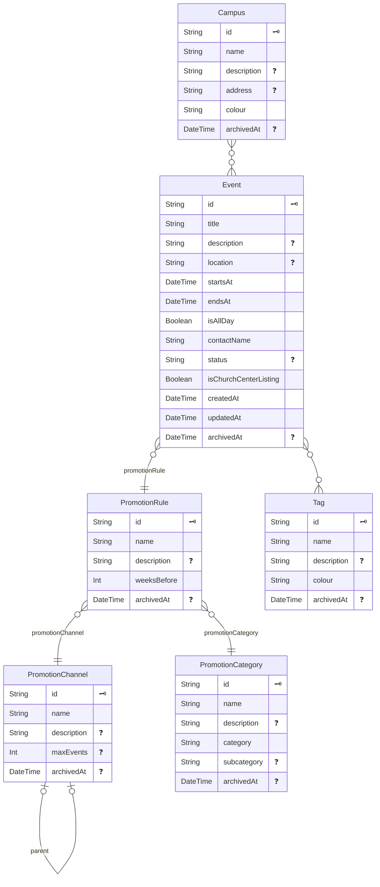

```mermaid
erDiagram

  "Campus" {
    String id "🗝️"
    String name 
    String description "❓"
    String address "❓"
    String colour 
    DateTime archivedAt "❓"
    }
  

  "PromotionChannel" {
    String id "🗝️"
    String name 
    String description "❓"
    Int maxEvents "❓"
    DateTime archivedAt "❓"
    }
  

  "PromotionRule" {
    String id "🗝️"
    String name 
    String description "❓"
    Int weeksBefore 
    DateTime archivedAt "❓"
    }
  

  "PromotionCategory" {
    String id "🗝️"
    String name 
    String description "❓"
    String category 
    String subcategory "❓"
    DateTime archivedAt "❓"
    }
  

  "Event" {
    String id "🗝️"
    String title 
    String description "❓"
    String location "❓"
    DateTime startsAt 
    DateTime endsAt 
    Boolean isAllDay 
    String contactName 
    String status "❓"
    Boolean isChurchCenterListing 
    DateTime createdAt 
    DateTime updatedAt 
    DateTime archivedAt "❓"
    }
  

  "Tag" {
    String id "🗝️"
    String name 
    String description "❓"
    String colour 
    DateTime archivedAt "❓"
    }
  
    "Campus" o{--}o "Event" : ""
    "PromotionChannel" |o--|o "PromotionChannel" : "parent"
    "PromotionRule" }o--|| "PromotionChannel" : "promotionChannel"
    "PromotionRule" }o--|| "PromotionCategory" : "promotionCategory"
    "Event" }o--|| "PromotionRule" : "promotionRule"
    "Event" o{--}o "Tag" : ""
```
