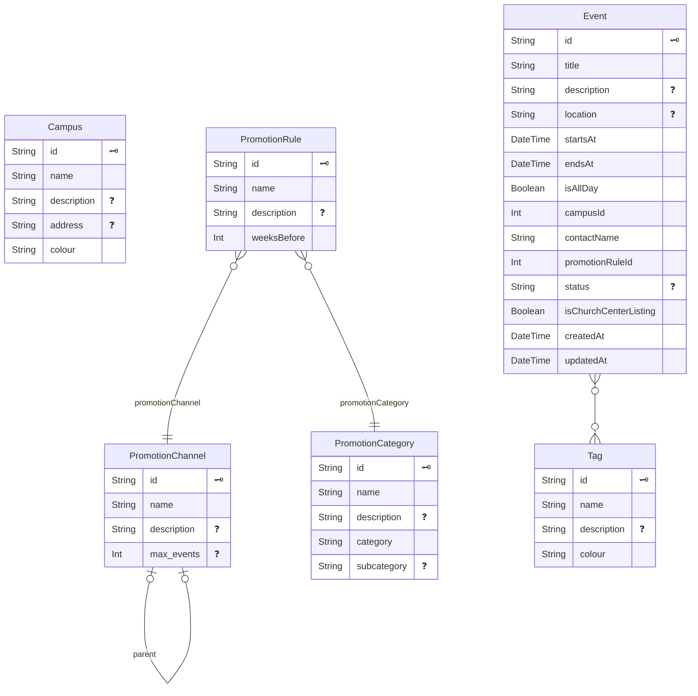

```mermaid
erDiagram

  "Campus" {
    String id "🗝️"
    String name
    String description "❓"
    String address "❓"
    String colour
    }


  "PromotionChannel" {
    String id "🗝️"
    String name
    String description "❓"
    Int max_events "❓"
    }


  "PromotionRule" {
    String id "🗝️"
    String name
    String description "❓"
    Int weeksBefore
    }


  "PromotionCategory" {
    String id "🗝️"
    String name
    String description "❓"
    String category
    String subcategory "❓"
    }


  "Event" {
    String id "🗝️"
    String title
    String description "❓"
    String location "❓"
    DateTime startsAt
    DateTime endsAt
    Boolean isAllDay
    Int campusId
    String contactName
    Int promotionRuleId
    String status "❓"
    Boolean isChurchCenterListing
    DateTime createdAt
    DateTime updatedAt
    }


  "Tag" {
    String id "🗝️"
    String name
    String description "❓"
    String colour
    }

    "PromotionChannel" |o--|o "PromotionChannel" : "parent"
    "PromotionRule" }o--|| "PromotionChannel" : "promotionChannel"
    "PromotionRule" }o--|| "PromotionCategory" : "promotionCategory"
    "Event" o{--}o "Tag" : ""
```
